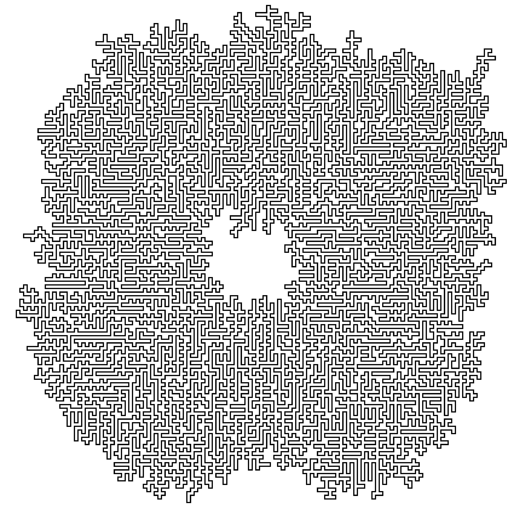

# Advent of Code 2023

[Advent of Code](https://adventofcode.com/)

## Progress/reflections

- Day 1: pleased I worked out that you can iterate once and check both ends, but level of nesting is a bit gross.
- Day 2: part 1 is straightforward using regex, part 2 is cool as you can use a look ahead
- Day 3: part 1 was relatively straightforward, part 2 I struggled with as decided to search for asterisks rather than use the existing search of numbers. Eventually looked at subreddit, where I got the idea to store + update list of gears based on number searches. Indexing the window proved finicky, but solved in the end!
- Day 4: relatively simple, using lookbehind/aheads to separate lists of numbers. In Part 2 I managed to simplify updating the cards, noting that it's not really as sequential as I first thought.
- Day 5: part 1 was easy enough. I gave up on part 2: clearly there are too many seeds to iterate through each; and you basically want to check the "pivot" points of the function, but given these are nested I wasn't entirely sure how to do so. I saw a suggestion that you could reverse the mapping, and just iterate through increasing locations to find the first seed -- I may try implement this at some point.
- Day 6: fairly straightforward: to avoid brute-forcing part 2 (and hence also revising part 1) I used the fact that the distribution of distances over holdtime is unimodal and symmetric. Could speed this code up even further by using binary searches to find the (lower) threshold.
- Day 7: fun part 1, using a merge sort (adapted using custom comparison function); not attempted part 2.
- Day 8: part 1 very easy, but used itertools.cycle to create circular list. Part 2 I had the brute-force approach but would have taken hours. Not sure why the LCM works here, but it does...
- Day 9: not sure it's the most efficient of code, but works pretty well -- part 2 was super easy change (though, intuitively, the position argument of .insert() should be the second, and not the first, argument...)
- Day 10: part 1 pretty easy -- could have sent two pointers opposite ways, but not sure this is more efficient than simply tracing route and dividing length by two. Wouldn't have been able to attempt part 2 without considerable help from existing solutions: learned the flood-fill algorithm (both recursive and non-recursive versions) as a result, and some basic "resolution scaling"
- Day 11: part 1 was straightforward (did the puzzle intentionally build on yesterday's resolution scaling?) but my solution was verbose and iterated through the map several times. In doing part 2 I noticed I could fold in part 1 as well, which led to far less verbose code (though could still be way more efficient I suspect)
- Day 12: recursion is always my undoing -- at least I recognised that this is what the problem needed! Looked at solutions pretty quickly and used time to think more about *why* it works, rather than code it myself. In part 2, I learned about memoization which is a cool trick!
- Day 13: catching up a day late, only intended to do part 1: simple using numpy array indexing. Then realised for part 2 you can simply ask whether, for any potential reflection (as part 1), the configuration across comparison rows/cols differs by at most 1 character. One nice strategy I've learned from previous days is not to solve the problem literally--i.e. here by implementing character switching--but to check whether a solution *can* be made
- Day 14: ooft -- that was fun! I had in mind while doing Part 1 that Part 2 would likely want a generalisation for tilting in any compass direction, and then realised that I didn't need a more general tilt function, but could instead just rotate the matrix itself and tilt North! 1 billion brute spins was impossible, so I figured there must be some shorter number of spins before the pattern starts cycling. So I implemented a hashmap for the (flattened) matrix, then just counted the extra number of spins needed. Still takes 16 seconds to run, and I'm sure others have much more efficient solutions